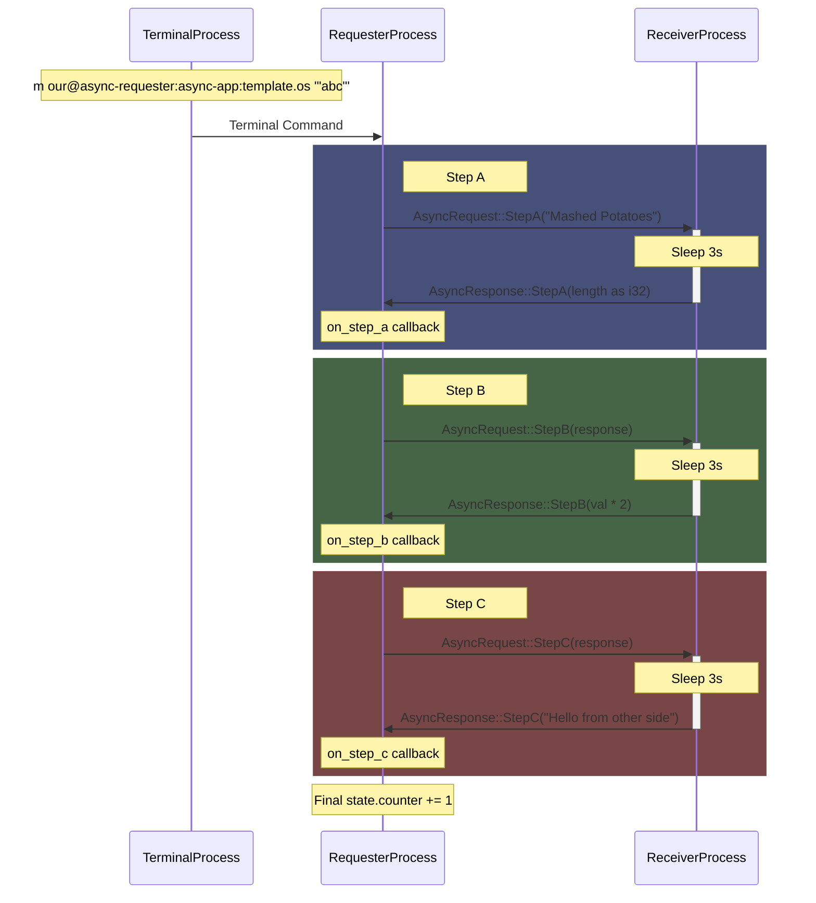

# 🔥🚀🤘 Kinode Processes 2.0 🔥🚀🤘

Shoutout to Doria (@dr-frmr) for the [initial app idea](https://github.com/kinode-dao/app-framework/tree/main), this is just a lot of sugar on top.

## How it Works

### Erecting Apps

```rust
erect!(
    "Async Receiver",
    None,
    None,
    http_handler,
    kino_local_handler,
    kino_remote_handler
);
```

The `erect!` macro takes several arguments in order:

- The name of our process
- The Icon (Optional)
- The Widget of the process (Optional)
- http_handler - function that handles incoming HTTP requests
- kino_local_handler - handles messages from processes on the same node
- kino_remote_handler - handles messages from other nodes

### Declaring Messaging Types

For instance, take this:

```rust
declare_types! {
    Async {
        StepA String => i32
        StepB i32 => u64
        StepC u64 => String
    },
    Commodore {
        Power SomeStruct => SomeOtherStruct
        Excitement i32 => Result<String, String>
    },
}
```

This will generate:

```rust
// Top level Request enum
#[derive(Debug, Serialize, Deserialize, SerdeJsonInto, Clone)]
pub enum Req {
    Async(AsyncRequest),
    Commodore(CommodoreRequest),
}

// Async variant types
#[derive(Debug, Serialize, Deserialize, SerdeJsonInto, Clone)]
pub enum AsyncRequest {
    StepA(String),
    StepB(i32),
    StepC(u64),
}

#[derive(Debug, Serialize, Deserialize, SerdeJsonInto, Clone)]
pub enum AsyncResponse {
    StepA(i32),
    StepB(u64),
    StepC(String),
}

// Commodore variant types
#[derive(Debug, Serialize, Deserialize, SerdeJsonInto, Clone)]
pub enum CommodoreRequest {
    Power(SomeStruct),
    Excitement(i32),
}

#[derive(Debug, Serialize, Deserialize, SerdeJsonInto, Clone)]
pub enum CommodoreResponse {
    Power(SomeOtherStruct),
    Excitement(Result<String, String>),
}
```

This isn't just syntactic sugar, this will enforce that for each request, there is a corresponding response, and enforces naming schemes that will come in _extremely_ useful for the next macro.

The naming scheme enforces these properties:

- For every request variant, there is a only ONE response variant (with the same name).
- Request enums always have the suffix `Request`, and Response enums always have teh suffix `Response`.

### Clean Async Sending

If we have declared our messaging structs with the macro (or followed the conventions), we can easily send async messages like so:

```rust
send_async!(
    receiver_address(),
    AsyncRequest::StepA("Mashed Potatoes".to_string()),
    (resp, st: AppState) {
        on_step_a(resp, st);
    },
);
```

The compiler will _know_ what the value of resp is (i32 in this case).
How cool is that???

You can then chain calls, for example like this:

```rust
fn on_step_a(response: i32, state: &mut AppState) {
    kiprintln!("Sender: Received response: {}", response);
    kiprintln!("Sender: State: {}", state.counter);
    state.counter += 1;
    send_async!(
        receiver_address(),
        AsyncRequest::StepB(response),
        (resp, st: AppState) {
            on_step_b(resp, st);
        },
    );
}
```

And then:

```rust
fn on_step_b(response: u64, state: &mut AppState) {
    kiprintln!("Sender: Received response: {}", response);
    kiprintln!("Sender: State: {}", state.counter);
    state.counter += 1;
    send_async!(
        receiver_address(),
        AsyncRequest::StepC(response),
        (resp, st: AppState) {
            on_step_c(resp, st);
        },
    );
}

fn on_step_c(response: String, state: &mut AppState) {
    kiprintln!("Sender: Received response: {}", response);
    kiprintln!("Sender: State: {}", state.counter);
    state.counter += 1;
}
```

### Example Message Flow (yes, claude did this)


